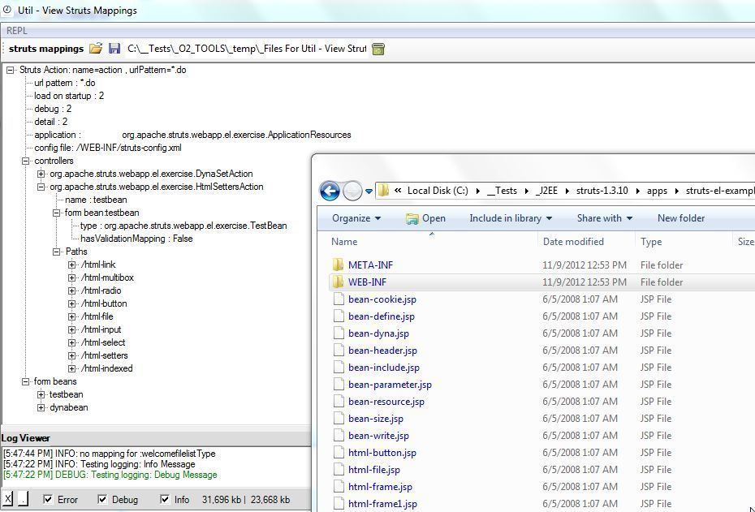
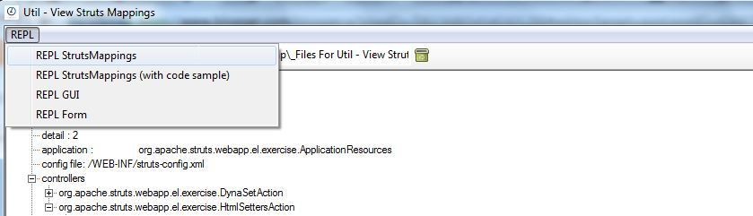
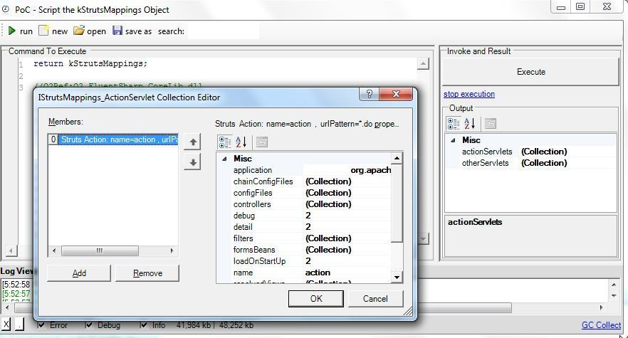
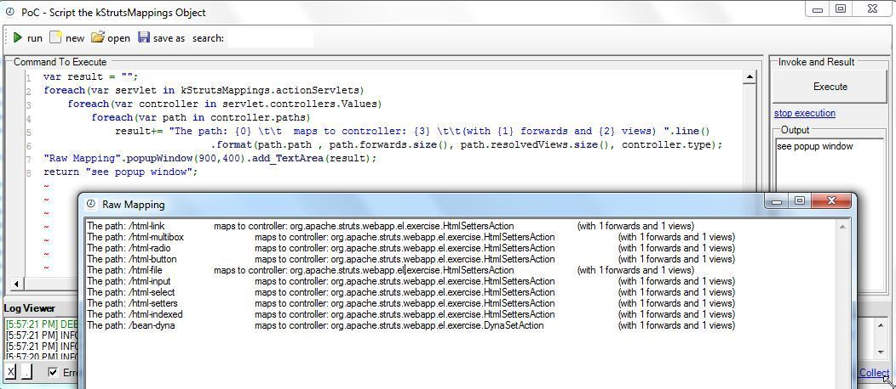
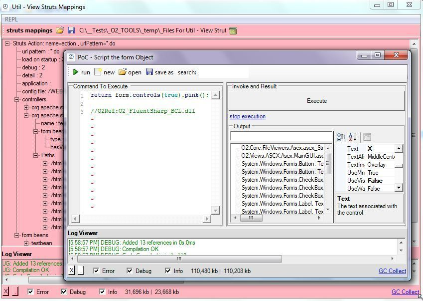
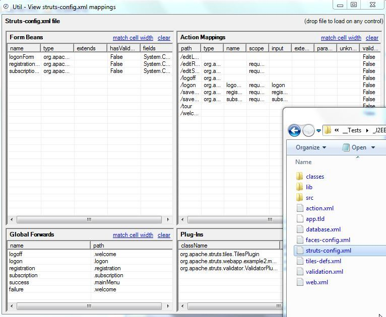
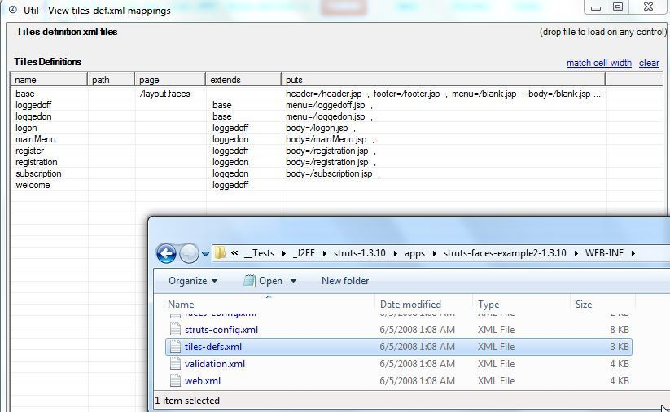
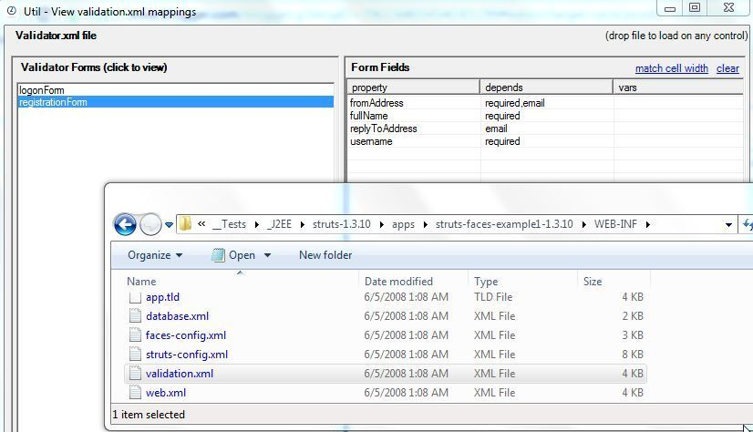
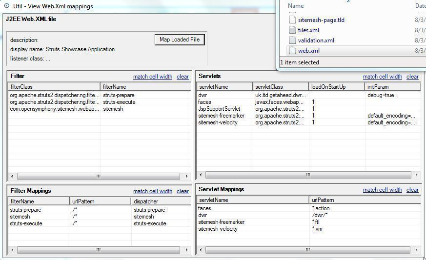

##  O2 tools to view and script J2EE, Struts and Tiles xml config files 

If you are reviewing Java/J2EE applications, here are a number of mini O2 tools that will help you to understand what is going on:

  * [Util - View Struts Mappings v.1.0.exe](https://dl.dropbox.com/u/81532342/O2Platform%20Tools/Java/Util%20-%20View%20Struts%20Mappings%20v.1.0.exe) (4.7Mb)
  * [Util - View struts-config.xml mappings v1.0.exe](https://dl.dropbox.com/u/81532342/O2Platform%20Tools/Java/Util%20-%20View%20struts-config.xml%20mappings%20v1.0.exe) (817kb)
  * [Util - View tiles-def.xml mappings v1.0.exe](https://dl.dropbox.com/u/81532342/O2Platform%20Tools/Java/Util%20-%20View%20tiles-def.xml%20mappings%20v1.0.exe) (816kb)
  * [Util - View validation.xml mappings v1.0.exe](https://dl.dropbox.com/u/81532342/O2Platform%20Tools/Java/Util%20-%20View%20validation.xml%20mappings%20v1.0.exe) (817kb)
  * [Util - View Web.Xml mappings v1.0.exe](https://dl.dropbox.com/u/81532342/O2Platform%20Tools/Java/Util%20-%20View%20Web.Xml%20mappings%20v1.0.exe) (817kb)

  

Bellow are these Tools in action (using the demo apps from [struts-1.3.10-all.zip](http://apache.mirrors.timporter.net//struts/binaries/struts-1.3.10-all.zip) )

**Util - View Struts Mappings v.1.0**  
**  
**Drop in the TreeView (white space) the WEB-INF folder

  
This control will load up the web.xml, struts-config.xml, tiles-def.xml and validation.xml config files, and create a **_mapping view_** of that data

The reason this exe is 4Mbs is because it includes the C# REPL script environment

  

  

Which can be used to access/script the **_StrutsMappings_** object created (and visualized in the TreeView shown above)

  

  
The _code sample_ menu item, shows how to easily access the the mapped Struts data:

  
The _REPL Form_ menu item, provides access the _Form _object which (for example) can be used to make all child controls pink :)

**Util - View struts-config.xml mappings v1.0.exe**

Drop the struts-config.xml file to see its mappings:

**  
****Util - View tiles-def.xml mappings v1.0.exe**

Drop the tiles-defs.xml file to see its mappings:

**  
****Util - View validation.xml mappings v1.0.exe**  
Drop the validation.xml file to see its mappings:  
**  
**  

**  
****  
****Util - View Web.Xml mappings v1.0**  
**  
**Drop the web.xml file to see its mappings:

If you like this (and are reviewing Java Apps with lots of interfaces) you should also check out the [Util - O2 Java Tools (IKVM Based) v1.0](http://diniscruz.blogspot.com/2012/10/util-o2-java-tools-ikvm-based-v10.html)
