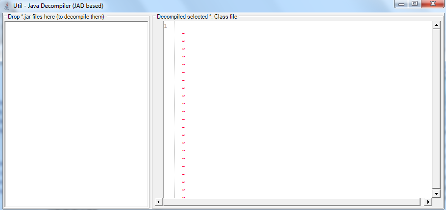
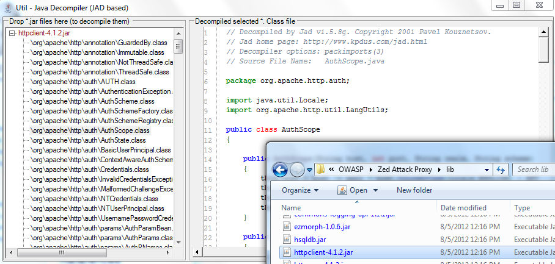
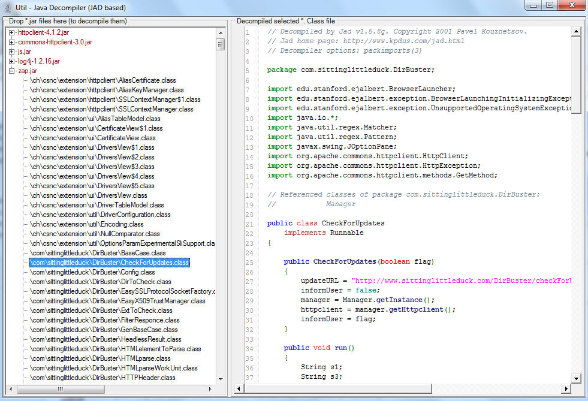

##  Util - Java Decompiler (JAD based) v1.0.exe 

If you want to take a quick look at the Java code inside a Jar file, here is a simple Java/Jar Decompiler (based on [the](http://en.wikipedia.org/wiki/JAD_(JAva_Decompiler)) [JAD](http://www.varaneckas.com/jad/) tool)

You can download the tool from: [Util - Java Decompiler (JAD based) v1.0.exe](https://dl.dropbox.com/u/81532342/O2Platform%20Tools/Java/Util%20-%20Java%20Decompiler%20%28JAD%20based%29%20v1.0.exe) (stand-alone O2 Platform script)  

This is what it looks like when you open it:

  
And this is what happens after a *.jar file is dropped in the left-hand-side TreeView:

  
You can drop multiple jar files:

  
Apart the initial delay (caused by the unziping of the dropped jar file into a temp folder), the decompilation should be quite quick.

**Other O2 Platform Java-based tools:**  

  * [O2 tools to view and script J2EE, Struts and Tiles xml config files](http://diniscruz.blogspot.com/2012/11/o2-tools-to-view-and-script-j2ee-struts.html)
  * [Util - O2 Java Tools (IKVM Based) v1.0](http://diniscruz.blogspot.com/2012/10/util-o2-java-tools-ikvm-based-v10.html)

**More details on how this tool was created:**
