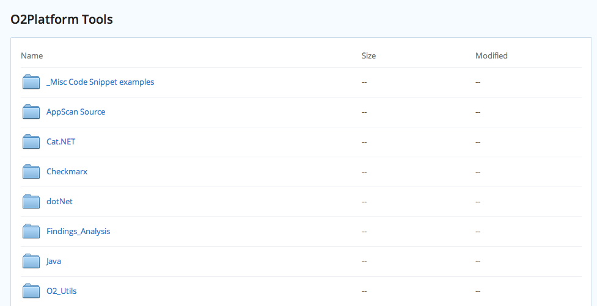
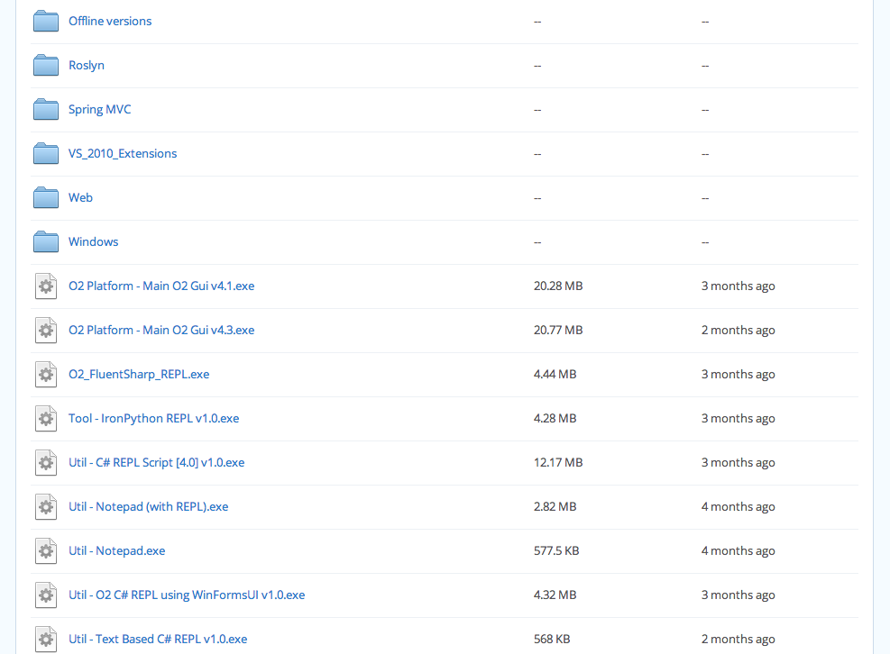

##  11 O2 stand-alone tools (with a lot more created but not blogged about) 

As part of the [new design](http://diniscruz.blogspot.com/2012/11/new-design-for-this-blog.html) of this blog, I just cleaned up a bit the [O2 Platform Tools](http://diniscruz.blogspot.co.uk/search/label/O2%20Platform%20Tool) Label/Page, and here are the 11 that have been published so far:  

  * [Util - Windows Handles Viewer (Simple GUI with REPL) v1.0.exe](http://diniscruz.blogspot.co.uk/2012/11/util-windows-handles-viewer-simple-gui_20.html) 
  * [Util - Windows Handles Viewer (Simple Gui) v1.0.exe](http://diniscruz.blogspot.co.uk/2012/11/util-windows-handles-viewer-simple-gui.html)
  * [Util - Java Decompiler (JAD based) v1.0.exe](http://diniscruz.blogspot.co.uk/2012/11/util-java-decompiler-jad-based-v10exe.html) 
  * [AppScan Source Findings in Ozasmt files (and O2 tools to View, Filter, Join, Stitch and Script them)](http://diniscruz.blogspot.co.uk/2012/11/appscan-source-findings-and-o2-tools-to.html) 
  * [O2 tools to view and script J2EE, Struts and Tiles xml config files](http://diniscruz.blogspot.co.uk/2012/11/o2-tools-to-view-and-script-j2ee-struts.html) 
  * [TM - Library Manager (with REPL) v1.2.3.exe](http://diniscruz.blogspot.co.uk/2012/11/tm-library-manager-with-repl-v123exe.html) 
  * [Util - Cir Viewer (with C# DLL converter) v1.0](http://diniscruz.blogspot.co.uk/2012/11/util-cir-viewer-with-c-dll-converter-v10.html) 
  * [WinDbg, Cdb, Sun-Of-Strike and Util - Start SoSNet (O2 Version).exe](http://diniscruz.blogspot.co.uk/2012/11/windbg-cdb-sun-of-strike-and-util-start.html) 
  * [Util - O2 Java Tools (IKVM Based) v1.0](http://diniscruz.blogspot.co.uk/2012/10/util-o2-java-tools-ikvm-based-v10.html) 
  * [Tool - O2 Cmd SpringMVC v1.0.exe - as standalone exe](http://diniscruz.blogspot.co.uk/2012/10/tool-o2-cmd-springmvc-v10exe-as.html) 
  * [Util - View CheatSheets at devcheatsheet.com v1.0.exe](http://diniscruz.blogspot.co.uk/2012/10/util-view-cheatsheets-at.html) 

  

Btw, **there are a lot more tools** (i.e. O2 *.h2 scripts) that I have created but have not had the time to write a blog post about.

  

If you are looking for a particular script or tool, take a [look at this public dropbox folder](https://www.dropbox.com/sh/xu90yd334ig0n7x/FU4ry6zemj/O2Platform%20Tools) 

  

  

  

**Question: **As I asked in [Should I start an O2 based 'A-Tool-a-Day' blog?](http://diniscruz.blogspot.com/2012/10/should-i-start-o2-based-tool-day-blog.html)  , **anybody has some cycles to help with this?**

  

Maybe we could do something like the old SysInternals website? Which was a big collection of Mark's tools filtered by type and target audience. Btw here are the (pre-Microsoft acquisition) exes/source-code of the original sysinternals tools: [http://court.shrock.org/sysinternals/](http://court.shrock.org/sysinternals/) )
