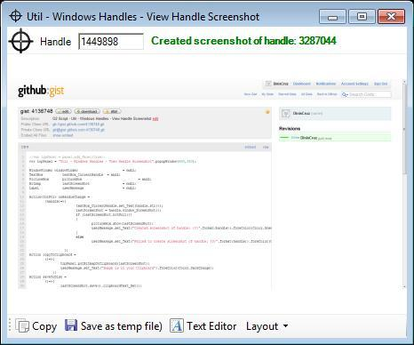

##  Util - Windows Handles - View Handle Screenshot v1.0.exe 

Following from [Util - Windows Handles Viewer (Simple GUI with REPL)](http://diniscruz.blogspot.com/2012/11/util-windows-handles-viewer-simple-gui_20.html) here is nice utility that takes a screenshot of the target handle's window (when the target process doesn't use the the Win32 Windows controls, you will get a screenshot of the main Window)

You can download the 868 Kb tool from: [Util - Windows Handles - View Handle Screenshot v1.0.exe](https://dl.dropbox.com/u/81532342/O2Platform%20Tools/Windows/Windows_Messages/Util%20-%20Windows%20Handles%20-%20View%20Handle%20Screenshot%20v1.0.exe)

  
Here is the tool taking a screenshot of itself :)

  
Here is the source code that creates tool:

  
And [here is the PDF](https://dl.dropbox.com/u/81532342/O2%20Raw%20Docs/Pdfs/Win32%20Window%20Handles%20-%20Creating%20a%20Handle%20Screenshot%20viewer.pdf) with the _'how the script was created_' step-by-step guide:

  

