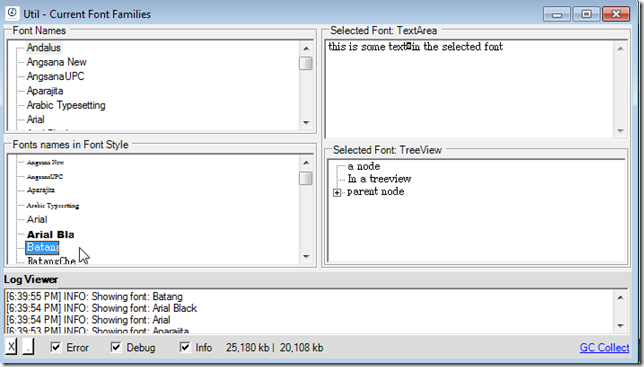

##  Util - Current Font Families.exe 

Today I needed to quickly see a list of available fonts in my current VM, so I quickly wrote this script:  

    
    var topPanel = "Util - Current Font Families".popupWindow(700,400)  
                                                 .insert_LogViewer();  
    //var topPanel = panel.clear().add_Panel();

    var fonts = System.Drawing.FontFamily.Families.toList();  
    if (fonts.first().Name == "Aharoni")  
    fonts.remove(0); //remove font Aharoni which was throwing errors  
    var fontsList = topPanel.title("Font Names").add_TreeView();  
    var fontsList_InStyle = fontsList.parent().insert_Below("Fonts names in Font Style").add_TreeView();  
    var textBox = topPanel.insert_Right("Selected Font: TextArea").add_TextArea()  
    .set_Text("this is some text\nin the selected font");  
    var treeView = textBox.insert_Below("Selected Font: TreeView").add_TreeView()  
    .add_Nodes(new [] {"a node", "In a treeview"})  
    .add_Node("parent node").add_Node("Child Node")  
    .treeView();  
    //textBox.font(font.Name);  
    Action<FontFamily> setFont =   
    (font)=>{   
    "Showing font: {0}".info(font.Name);  
    treeView.font(font.Name);  
    textBox.font(font.Name);  
    };

    fontsList.afterSelect<FontFamily>(setFont);   
    fontsList_InStyle.afterSelect<FontFamily>(setFont);   
    fontsList.add_Nodes(fonts,  
    (font)=>font.Name,  
    (font)=>font,  
    (font)=>false)   
    .selectFirst()  
    .add_ContextMenu()  
    .add_MenuItem("copy to clipboard", ()=> fontsList.selected().get_Text().clipboardText_Set());

      
    fonts.toList().forEach<FontFamily>(  
    (font)=>{   
    fontsList_InStyle.add_Node(font.Name, font)  
    .font(font.Name.font());  
    });  

  
Packaged as a stand-alone exe:

which you can download from: [Util - Current Font Families v1.0.exe](https://o2platform.googlecode.com/files/Util%20-%20Current%20Font%20Families%20v1.0.exe)

and looks like this:

    

you can select a font name (on either **_TreeViews_** on the left), and see what that font looks like on a **_TextArea_** or **_TreeView_**

