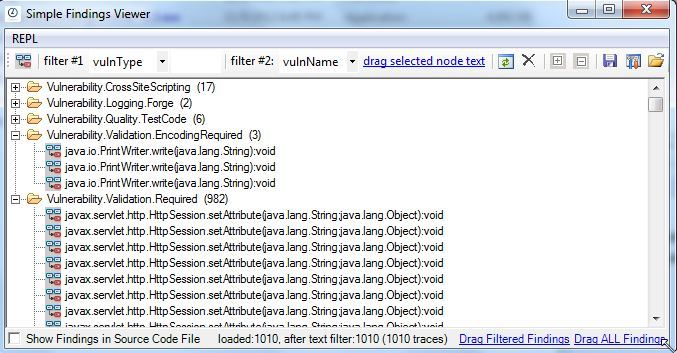
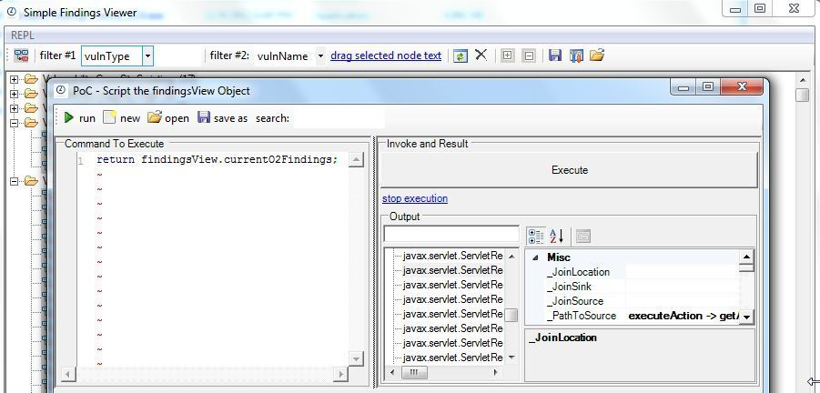
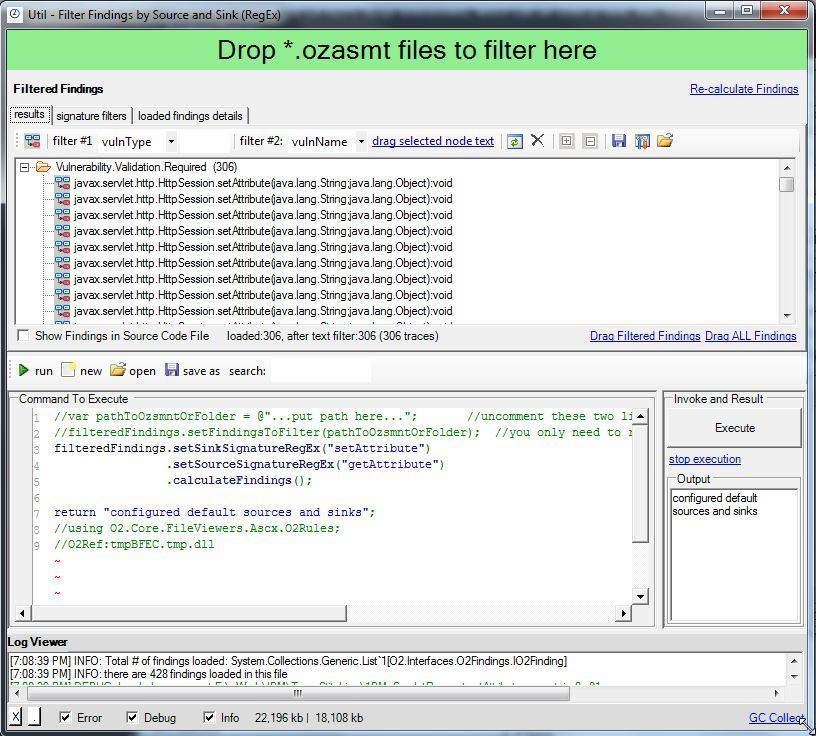
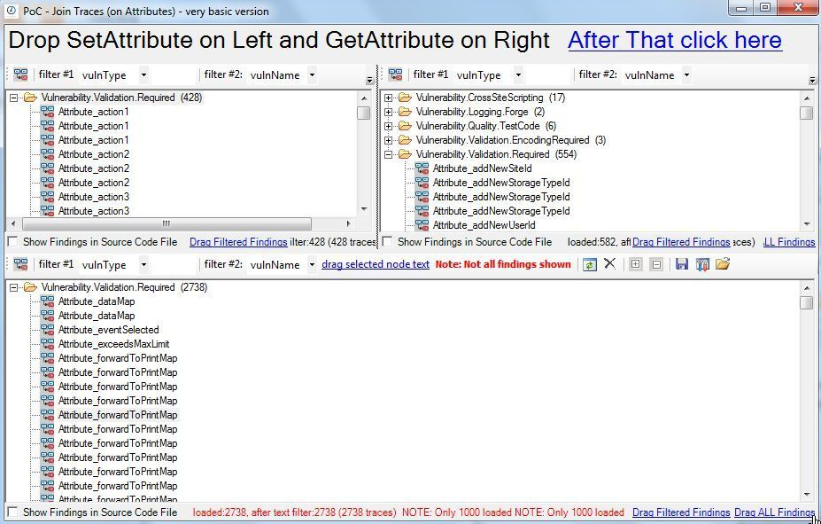

##  AppScan Source Findings in Ozasmt files (and O2 tools to View, Filter, Join, Stitch and Script them) 

If you are using AppScan Source (previously called OunceLabs) you will find these O2 Tools really useful:  

  * [Util - Simple Findings Viewer v1.1.exe](https://dl.dropbox.com/u/81532342/O2Platform%20Tools/Findings_Analysis/Util%20-%20Simple%20Findings%20Viewer%20v1.1.exe) (4.8Mb)
  * [Util - Simple Findings Viewer (with code viewer) v1.1.exe](https://dl.dropbox.com/u/81532342/O2Platform%20Tools/Findings_Analysis/Util%20-%20Simple%20Findings%20Viewer%20%28with%20code%20viewer%29%20v1.1.exe) (4.8Mb)
  * [Util - Filter Findings by Source and Sink (RegEx) v1.1exe](https://dl.dropbox.com/u/81532342/O2Platform%20Tools/Findings_Analysis/Util%20-%20Filter%20Findings%20by%20Source%20and%20Sink%20%28RegEx%29%20v1.1.exe) (4.8Mb)
  * [PoC - Join Traces (on Attributes) - very basic version v1.0.exe](https://dl.dropbox.com/u/81532342/O2Platform%20Tools/Findings_Analysis/PoC%20-%20Join%20Traces%20%28on%20Attributes%29%20-%20very%20basic%20version%20v1.0.exe) (4.8Mb)

  
Note that these modules are some of the oldest ones in O2 (created during really hard-core security review engagements during my OunceLabs time), and the APIs that support these modules are REALLY powerful (**and allow the analysis of thousands or millions of Findings/Traces**)

  

Most of the code that creates these tools is now on the O2.Platform.Scripts folder (see [Findings_Filtering](https://github.com/o2platform/O2.Platform.Scripts/tree/master/APIs/Findings_Filtering) at GitHub)

**  
**

**  
**

**Util - Simple Findings Viewer v1.0.exe** 

  

Supports the viewing of AppScan Source 8.x, 7.x and 6x *.ozasmt files (all the way back to the OunceLabs releases)

  

  
The C# REPL script environment can be used to view, edit, manipulate, join, stitch, delete or move Findings/Traces:

  

  

  

**Util - Filter Findings by Source and Sink (RegEx) v1.0.exe**

**  
**

Easy way to script custom source-to-sink mappings:

**  
**

**  
**

  

**PoC - Join Traces (on Attributes) - very basic version v1.0.exe**  
**  
**Example of how to join/stitch Attributes, HashMaps and Getters/Setters (for example setAttributes with getAttributes)  
**  
**  

  

  

  

  

  

  

