##  REPL GUI for Clojure-CLR (C# port of Lisp's Clojure) 

Here is a script/tool I wrote a while back (when I wanted to see what Lisp was all about), where I created a REPL Gui based on the amazing [Clojure-clr](https://github.com/clojure/clojure-clr) project (which is CLR port of [Clojure](http://clojure.org/))

You can download this [O2 Platform](http://blog.diniscruz.com/p/owasp-o2-platform.html) tool from: [Util - Clojure-clr REPL (Lisp) v.2.0.exe](https://dl.dropbox.com/u/81532342/O2Platform%20Tools/Lisp/Util%20-%20Clojure-clr%20REPL%20%28Lisp%29%20v.2.0.exe)

This is a 9Mb standalone exe (only requirement is the .NET Framework 4.0 running on a Windows box):

[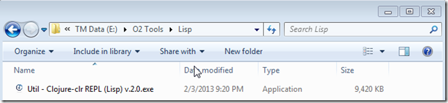](http://lh5.ggpht.com/-VVB_YwqpY0g/UQ7cJr4M48I/AAAAAAAAI4g/nl58IQVC5uw/s1600-h/image%25255B2%25255D.png)

which looks like this when executed:

[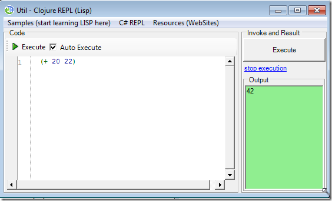](http://lh5.ggpht.com/-NvluhyM52SY/UQ7cLnCUiNI/AAAAAAAAI4s/EknVgnxHcJs/s1600-h/image%25255B5%25255D.png)

As with all the other [O2 Platform based REPLs](http://blog.diniscruz.com/search/label/REPL), this is a real time execution and compilation environment:

[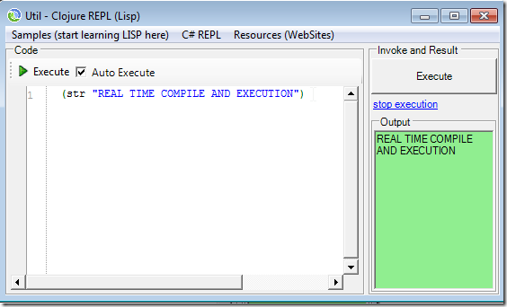](http://lh6.ggpht.com/-6IuNYyUBf-Y/UQ7cNSpiUaI/AAAAAAAAI5A/qEBfPQgK1dw/s1600-h/image%25255B11%25255D.png)

Since you (like me) are most likely new to LISP, I included in this tool a **_Samples_** drop-down menu containing a number of LISP code snippets:

[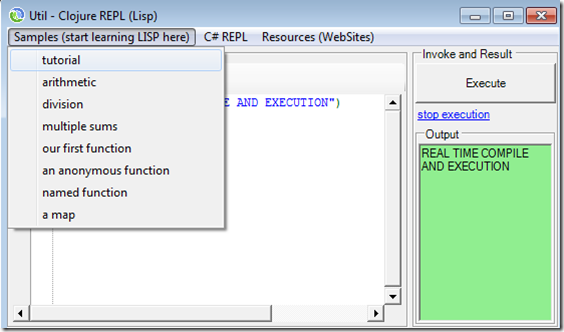](http://lh5.ggpht.com/-3OHWo73TvkY/UQ7cPK_2EGI/AAAAAAAAI5M/ibixxdYx2Lg/s1600-h/image%25255B19%25255D.png)

Note: these code examples were based on the great [http://tryclj.com/](http://tryclj.com/) online tutorial:

[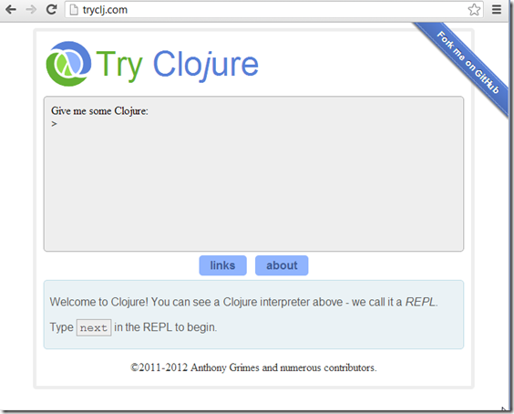](http://lh6.ggpht.com/-i4X7DLyT3PQ/UQ7cRHgznUI/AAAAAAAAI5g/gbBw3V5ryS8/s1600-h/image%25255B23%25255D.png)

For reference, here are the LISP Code Snippets  in action:

**Tutorial**  
[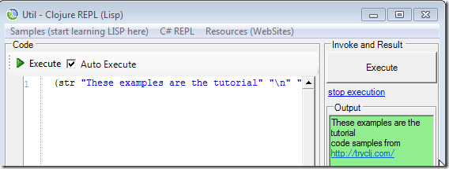](http://lh5.ggpht.com/-vqc6BnIPq10/UQ7cSrYM2ZI/AAAAAAAAI5s/DVnWlomR3Ls/s1600-h/image%25255B26%25255D.png)

**Arithmetic**  
[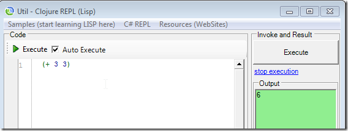](http://lh4.ggpht.com/-77A65P552tw/UQ7cUffwYQI/AAAAAAAAI6A/OCHKt_3Uzfs/s1600-h/image%25255B29%25255D.png)

**Division**  
[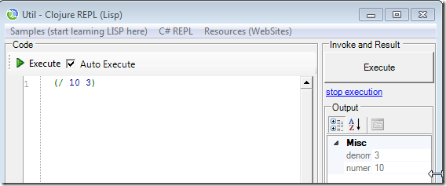](http://lh6.ggpht.com/-_9dhKRd3_yc/UQ7cV0ncBUI/AAAAAAAAI6Q/tat-H5JV9gE/s1600-h/image%25255B32%25255D.png)

**Multiple sums**  
[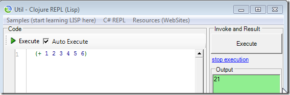](http://lh5.ggpht.com/-yqsAskjfmgw/UQ7cXgoQwLI/AAAAAAAAI6c/4qzchyIX6j4/s1600-h/image%25255B35%25255D.png)   
**  
****Our first function**  
[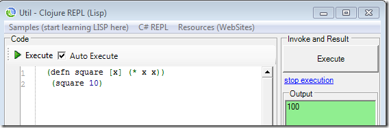](http://lh6.ggpht.com/-xPdSB9kGxys/UQ7cZGAXgLI/AAAAAAAAI6s/mRjld51v5E0/s1600-h/image%25255B38%25255D.png)

**An anonymous function**  
[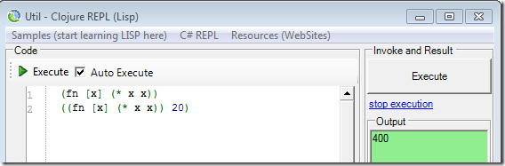](http://lh5.ggpht.com/-fRc2guNNkpI/UQ7cauNEVII/AAAAAAAAI7A/ppxFhD3sJrc/s1600-h/image%25255B41%25255D.png)  
**  
****Named function**  
[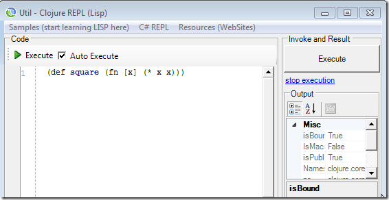](http://lh6.ggpht.com/-r1CiBNOCBq0/UQ7ccciCWaI/AAAAAAAAI7M/A_fTpPW2JUc/s1600-h/image%25255B44%25255D.png)  
**  
****A map**  
[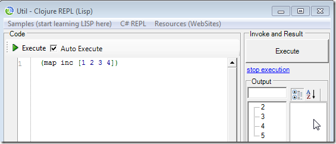](http://lh5.ggpht.com/-JQr9jMlDlAs/UQ7cdyyrknI/AAAAAAAAI7c/x1pTOaOYnc8/s1600-h/image%25255B47%25255D.png)
