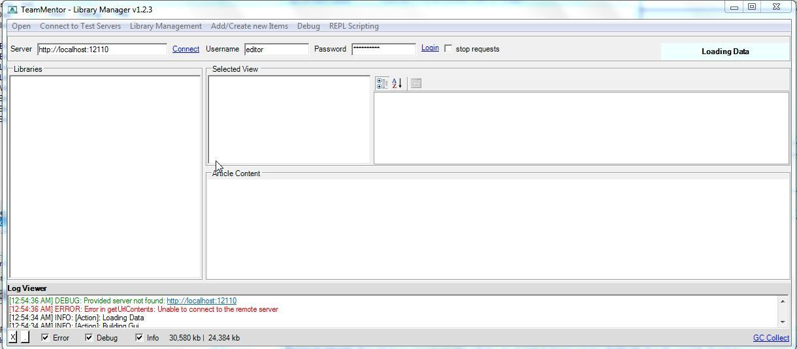
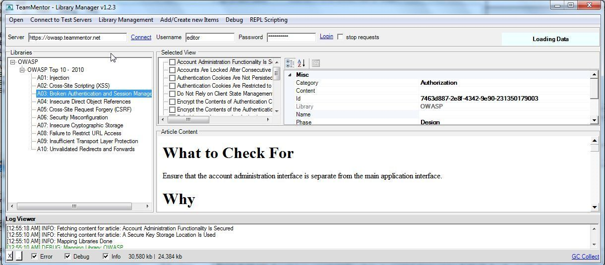
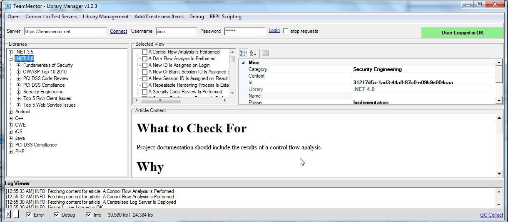
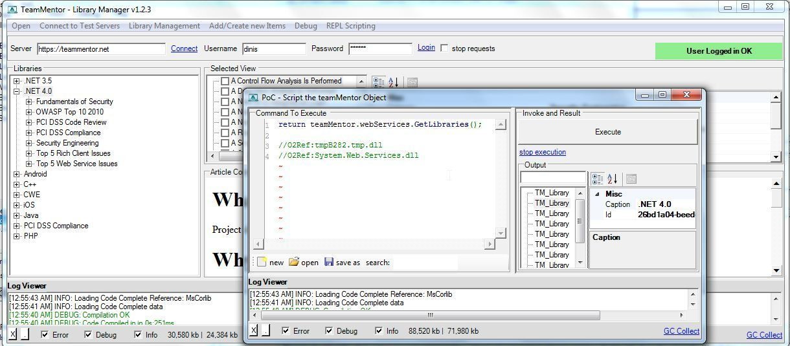

##  TM - Library Manager (with REPL) v1.2.4.exe 

Here is a (still quite raw) Library Manager for TeamMentor with REPL support (packaged as an O2 Platform stand-alone exe).

You can download this version from: [TM - Library Manager (with REPL) v1.2.4.exe](https://dl.dropbox.com/s/3a860dfsaj9tf31/TM%20-%20Library%20Manager%20%28with%20REPL%29%20v1.2.4.exe)  
  
If you want to run the scripts directly from O2 (or modify them), fork the [UnitTests ](https://github.com/TeamMentor/UnitTests/tree/master/LibraryManagement)repository and  [take a look in this Library Management folder](https://github.com/TeamMentor/UnitTests/tree/master/LibraryManagement)).  

  

  
**Here are some screenshots of this tool in action:**  
**  
**Default screen (which tries to connect to a local TM instance which in this case there wasn't one)

  
Connecting to the owasp.teammentor.net server

  
Connecting to the teammentor.net server (which needs a valid login to see the content)

  
Using the built in REPL script editor to directly invoke the TM webservices

**Here is a video of an older version of this tool**

The Gui has changed a bit, but the drag-and-drop operation works the same way (note how you open two instances of this tool to copy articles between TM servers)

  
**  
****Features requests**  
**  
**This version is due a refresh (since there were a couple features added to the TM WebServices that will make it much faster and more efficient), so if you have ideas on what should be added, please use this [Issue Tracking](https://github.com/TeamMentor/UnitTests/issues) to register them 
