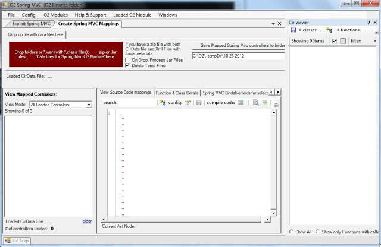
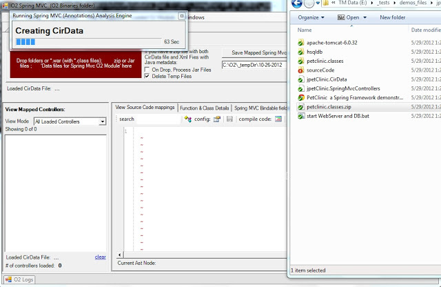
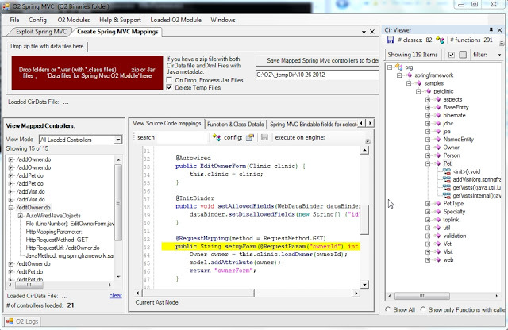
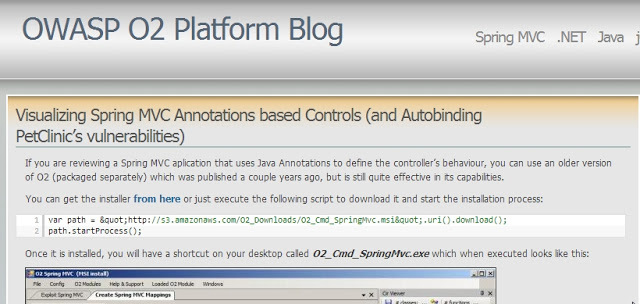
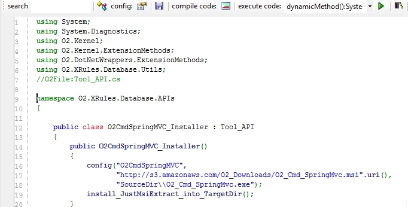
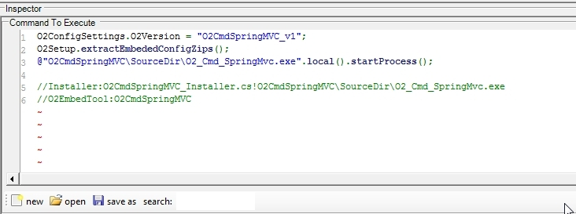
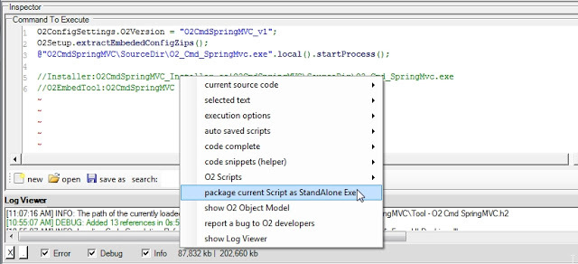
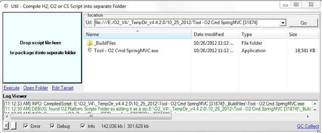

##  Tool - O2 Cmd SpringMVC v1.0.exe - as standalone exe 

I just had a request  for the O2's Spring MVC module (developed ages ago), and It was was a good opportunity to test the latest version of the '_O2 Standalone tool builde_r', since it now supports the embedding of the tools installed via an O2 Script (usually stored in the _ToolsOrApis folder).

You can download the [Tool - O2 Cmd SpringMVC v1.0.exe](https://dl.dropbox.com/u/81532342/O2Platform%20Tools/Spring%20MVC/Tool%20-%20O2%20Cmd%20SpringMVC%20v1.0.exe) (or build it using O2) which is the stand alone exe of the old **_O2_Cmd_SpringMvc.ms_**_i_ tool (See at the end of this post for details on how this exe was created)

  

  
When you open this tool, you will get a GUI that looks like this:

  
Then if you drop a jar (or the zip of *.classes like the one you will find in the [jPetClinic -- O2 Demo Pack.zip](http://s3.amazonaws.com/Demo_Files/jPetClinic%20-%20O2%20Demo%20Pack.zip)  that you get from the [Packaged Spring MVC Security Test Apps: JPetStore and PetClinc](http://o2platform.wordpress.com/2011/07/18/packaged-spring-mvc-security-test-apps-jpetstore-and-petclinc/) ), a series of conversions will occur (Jython is used to parse the java byte code) :  

  

  

  
Which when finished will look like this:

  
For a detailed explanation of how this module works (including the VERY important **_/*O2Helper:MVCAutoBindListObject_**: hack) take a look at this blog post:  
[Visualizing Spring MVC Annotations based Controls (and Autobinding PetClinic's vulnerabilities)](http://o2platform.wordpress.com/2011/07/19/visualizing-spring-mvc-annotations-based-controls-and-autobinding-petclinics-vulnerabilities/)

  

  

## How the [Tool - O2 Cmd SpringMVC v1.0.exe](https://dl.dropbox.com/u/81532342/O2Platform%20Tools/Spring%20MVC/Tool%20-%20O2%20Cmd%20SpringMVC%20v1.0.exe)  was created

It was quite easy to package the O2_Cmd_SpringMvc.msi tool (note-to-self: do this for the other really powerful old O2 tools that are gathering dust in the O2 archives)

  

**Step 1: Create an installer that downloads and extracts the msi:**

**  
**

  

**Step 2: In an O2 C# REPL script create the_ Tool - O2 Cmd SpringMVC.h2_ file**

  

Which will consume the installers (shown above) and will trigger the extraction (when executed for the first time as a standalone exe)

  

  

**Step 3: Open the context menu and chose the item to package the current script**

  

  
And that's it!

The package tool (which is a script it self) should be open with the created exe:

  
It's quite powerful the fact that it took me longer to write this blog post than to package that old O2 tool  :)
