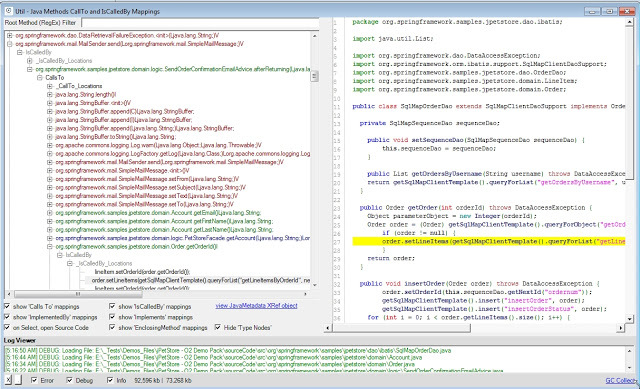
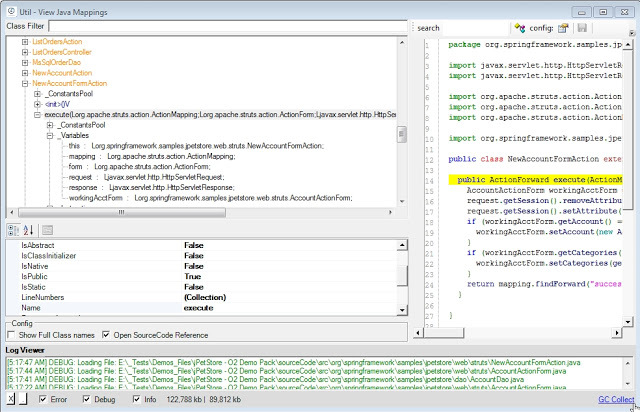
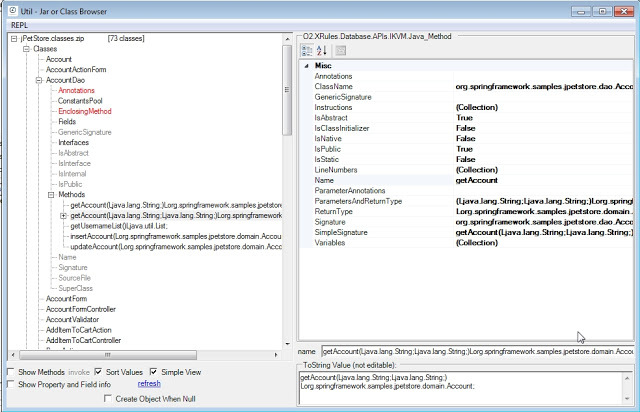
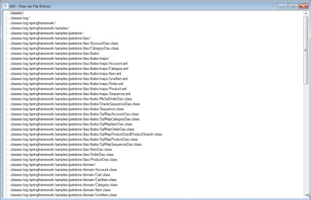
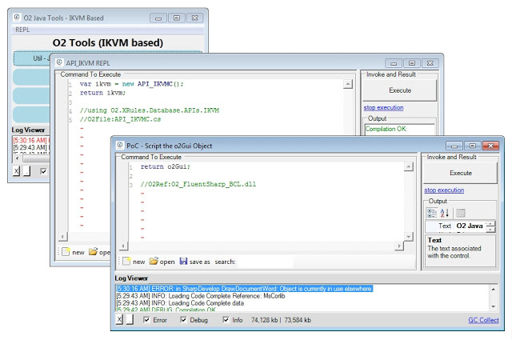

##  Util - O2 Java Tools (IKVM Based) v1.0 

For the Java users, here are a couple O2 Tools that expose GUIs to view java class files  and programatically analyze them.

These tools leverage the amazing [IKVM ](http://www.ikvm.net/)project to parse the Java class files into C# classes.

You can download the exe from [Util - O2 Java Tools - IKVM Based v1.0.exe](https://dl.dropbox.com/u/81532342/O2Platform%20Tools/Java/Util%20-%20O2%20Java%20Tools%20-%20IKVM%20Based%20v1.0.exe) (its 20Mb since it includes the latest version of IKVM)  

When you start this exe, you will see this menu:  

  

  

Which is a launcher for the following 4 tools (included as *.h2 scripts which will be compiled on first run):

  

**Util - Java Methods CallTo and IsCalledBy Mappings.h2**

  

  

  

  

**Util - View Java Mappings.h2**

**  
**

  

**Util - Jar or Class Browser.h2**

**  
**

**  
**

**  
**

**Util - View Jar File Entries.h2**

  

  

  

**Included REPL Script environment**

And as with most O2 tools, what is really powerful is the fact that these APIs and GUIs are all easily scripted using the provided REPL C# Script environment (via REPL menu):

  

