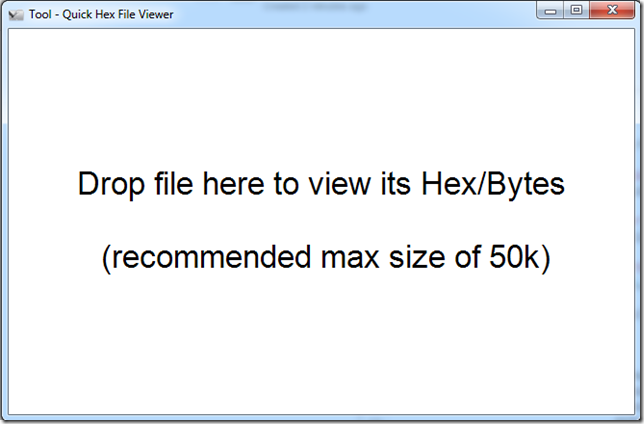
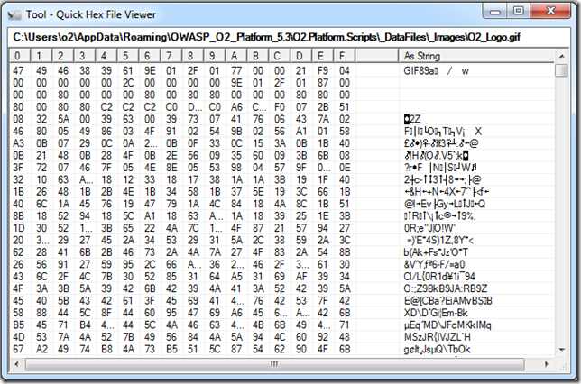
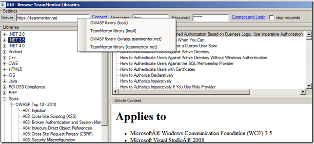
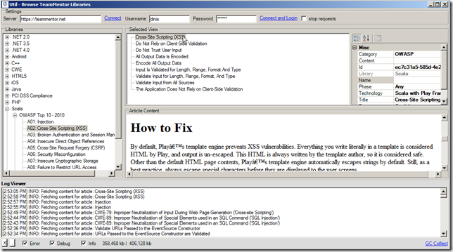

##  Util - Quick Hex File Viewer.exe 

When I was creating the [Generating Fuzzing Images and trying them on WebBrowser (IE)](http://blog.diniscruz.com/2013/08/generating-fuzzing-images-and-trying.html)  and [Install Debugging Tools for Windows as a Standalone Component](http://blog.diniscruz.com/2013/08/install-debugging-tools-for-windows-as.html) scripts I needed a simple and fast HEX viewer.

Since I didn't had one at hand, I quickly wrote an O2 Script that uses a C# ListView to show binary data (see [source code](https://gist.github.com/DinisCruz/6246348) below)

Here is the link to the Stand-Alone tool: [Util - Quick Hex File Viewer v1.0.exe](https://dl.dropboxusercontent.com/u/81532342/O2Platform%20Tools/Windows/Util%20-%20Quick%20Hex%20File%20Viewer%20v1.0.exe)

Which looks like this when executed:  
  
 

... like this after a binary file is dropped inside it:

... and like this after a text file is dropped inside it:

**Here i[s the script](https://gist.github.com/DinisCruz/6246348) that creates this tool:**  
(also included in the O2.Platform.Scripts repository as _Util - Quick Hex File Viewer v1.0.h2_)

  
    
Finally here is the moment I uploaded the packaged stand-alone exe to dropbox (which is the location of the [direct link](https://dl.dropboxusercontent.com/u/81532342/O2Platform%20Tools/Windows/Util%20-%20Quick%20Hex%20File%20Viewer%20v1.0.exe) to this tool)

