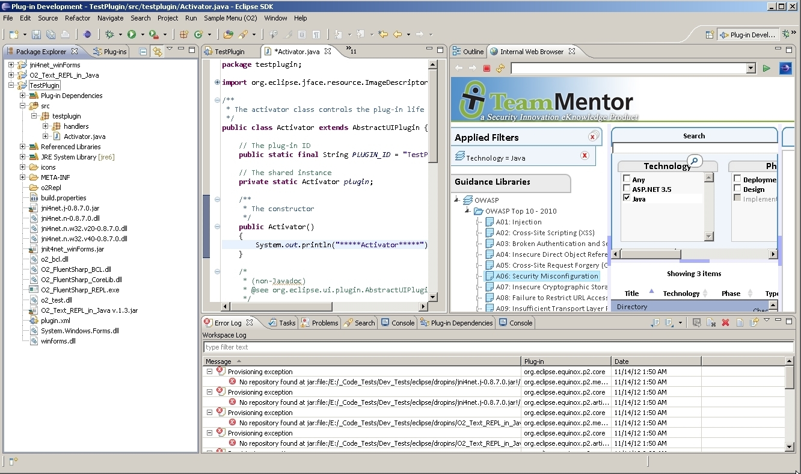

##  Util - Windows Handles Viewer (with Child Windows) v1.0.exe 

Following from the tool shown in [Util - Windows Handles - View Handle Screenshot v1.0](http://diniscruz.blogspot.co.uk/2012/11/util-windows-handles-view-handle.html), the next step was to create a tool that shows (for the selected Win32 Window) the handle's children structure (i.e. what '_child windows_' exists for the selected window/control)

You can download the 1 Mb tool from [Util - Windows Handles Viewer (with Child Windows) v1.0.exe](https://dl.dropbox.com/u/81532342/O2Platform%20Tools/Windows/Windows_Messages/Util%20-%20Windows%20Handles%20Viewer%20%28with%20Child%20Windows%29%20v1.0.exe)

Here is what the tool looks like (with the '_target icon'_ used to select the control):

Here is [the Pdf ](https://dl.dropbox.com/u/81532342/O2%20Raw%20Docs/Pdfs/Win32%20Window%20Handles%20-%20Creating%20a%20Handle%20Child%20Windows%20viewer.pdf)with the '_how the script was created'_ step-by-step guide:  

