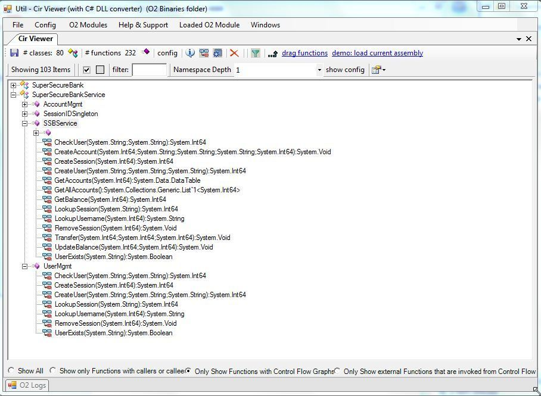
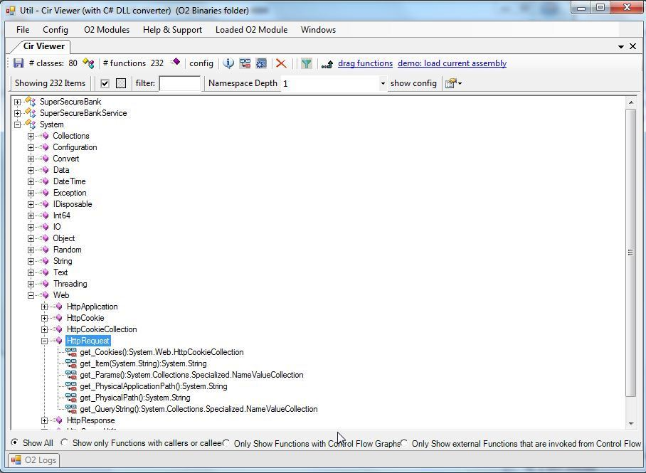
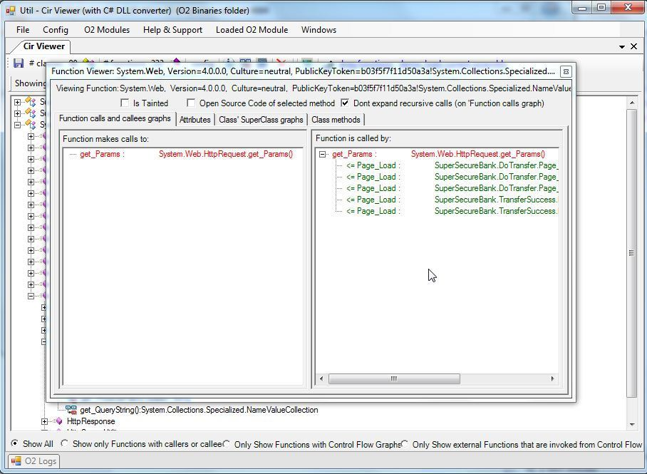

##  Util - Cir Viewer (with C# DLL converter) v1.0 

Here is an oldie one by still really effective.

I just rebuilt the O2's CirViewer (CIR = Common Intermediate Representation (from the OunceLabs days)) as an easy to consume stand-alone tool which you can get from: [Util - Cir Viewer (with C# DLL converter) v1.0.exe](https://dl.dropbox.com/u/81532342/O2Platform%20Tools/dotNet/Util%20-%20Cir%20Viewer%20%28with%20C%23%20DLL%20converter%29%20v1.0.exe)  

There are a number of uses for this module, but one you can use to get a feel for it to to drop an .Net assembly (dll or exe) add take a look (you can also drop a folder)

**Default view:**  
**  
**  

  
**Showing all APIs used:**

  
**Viewing the 'Who calls Who' trees:**

  

  

  

