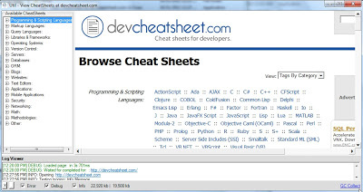
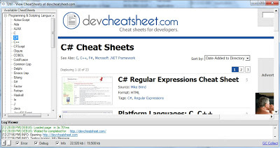
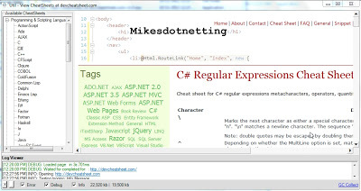
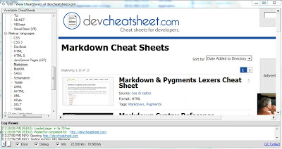
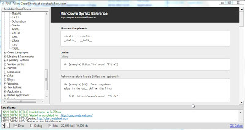

##  Util - View CheatSheets at devcheatsheet.com v1.0.exe 

Here is a little mini-tool (that I used today) which provides a nice GUI for viewing the CheatSheets at devcheatsheet.com.

The stand-alone exe is only 1Mb and you can download it from: [Util - View CheatSheets at devcheatsheet.com v1.0.exe](https://dl.dropbox.com/u/81532342/O2Platform%20Tools/Web/Util%20-%20View%20CheatSheets%20at%20devcheatsheet.com%20v1.0.exe)  

The O2 Script is called _Util - View CheatSheets at devcheatsheet.com.h2 _ and this is what it looks like:

  

  

  

  

