##  Writing an IE Automation script to login into UK's Wifi (using O2 Platform's WatiN ExtensionMethods) 

Here is an example of how to write an O2 Platform IE Automation script that will login a user into a wifi connection that needs a username and password.

Open the IE Script tool which you can get from this [stand-alone version](https://o2platform.googlecode.com/files/IE%20Automation%20%28Simple%20mode%29%20v1.0.exe) (see [Packaging an O2 Platform Script as a stand alone tool (in this case the WatiN based 'IE Script' tool)](https://blog.diniscruz.com/2013/03/packaging-o2-platform-script-as-stand.html) )

Or from the main O2 Platform gui:

When opened it, should look like this:

[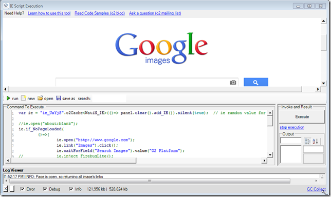](http://lh4.ggpht.com/-FAfrPooOvlg/UUMoJo-G9gI/AAAAAAAAKts/lIf7keoxKho/s1600-h/image%25255B154%25255D.png)

Leave the first line and open the default wifi connection page (see at the end of this post for the scripts created in a format you can copy and paste):

[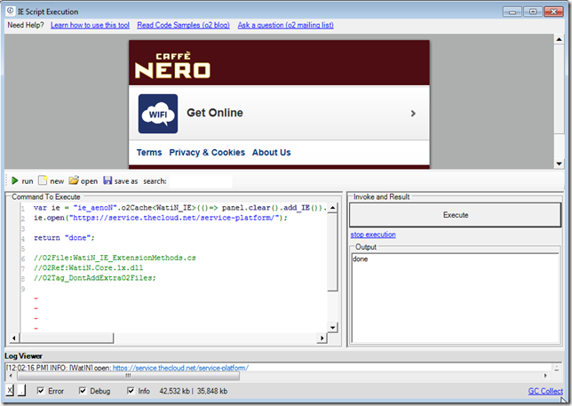](http://lh3.ggpht.com/-0O26JHlZM4I/UUMoN7g4U0I/AAAAAAAAKt8/3yw8TWb74O0/s1600-h/image%25255B7%25255D.png)

Take a look at the HTML links of this page (I commented out the **_ie.open_** since the browser session is persisted on multiple executions):

Here is how to get a specific link (note the multiple variations caused by the fact that the **_Get Online_** link has no ID and a new line in its text:

Next step is to click on the link:

Next get the links for this page and look at the details of the link we want to click next:

Which has the same issue of a new line at the beginning and no ID

Let's click on that Link:

[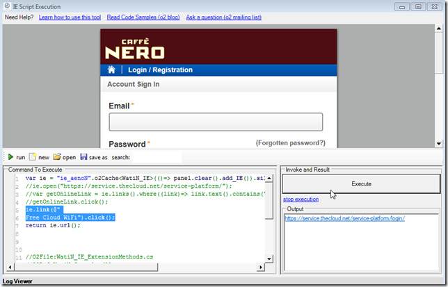](http://lh4.ggpht.com/-_PrXBMdek9E/UUMoj8LBC4I/AAAAAAAAKvc/DRtQNvAdaOk/s1600-h/image%25255B37%25255D.png)

And look at the fields in this page:

[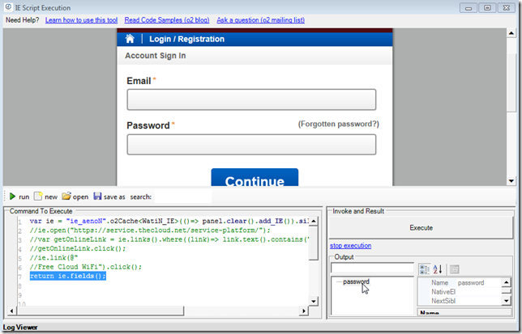](http://lh6.ggpht.com/-u4m7oZy7aN0/UUMonDcqq8I/AAAAAAAAKvs/DbWEEpCo-Wk/s1600-h/image%25255B40%25255D.png)

In there find the **_password_** one

Note that we can edit this field and see its changes in real-time:

[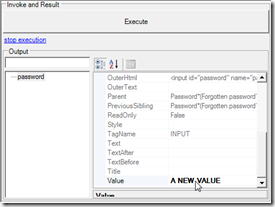](http://lh3.ggpht.com/-9n56OoB5gl4/UUMouNAbvUI/AAAAAAAAKwM/zckoa_lKvZE/s1600-h/image%25255B50%25255D.png)  [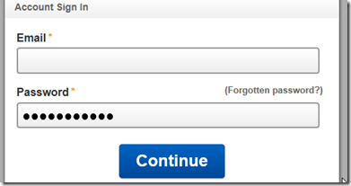](http://lh3.ggpht.com/-bEI7oLBbhGA/UUMoy-O8qNI/AAAAAAAAKwc/6JXHymZYAS0/s1600-h/image%25255B51%25255D.png)

We can now get the reference to the password field:

[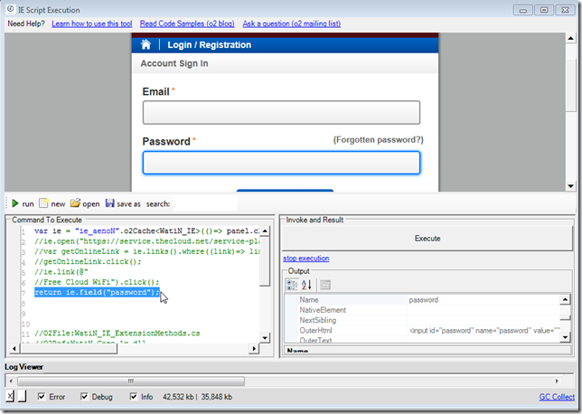](http://lh5.ggpht.com/-Uhy3TmjBS9g/UUMo1vrHEoI/AAAAAAAAKws/uJYYiQlQ7sc/s1600-h/image%25255B54%25255D.png)

and change its value programmatically:

[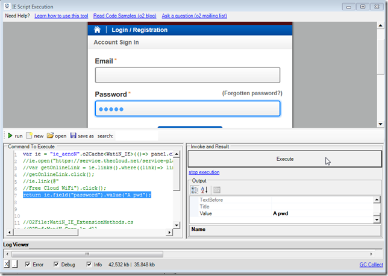](http://lh4.ggpht.com/-E7LO34t6Vyg/UUMo4Ua_CXI/AAAAAAAAKw8/VwSsY1R5VOo/s1600-h/image%25255B57%25255D.png)

Now the email field is going to be a little more complicated since it wasn't picked up by the **_fields WatiN _**Extension Method.

So take a look at the _**.elements() **_:

And get a programmatic reference to it:

Get its outerHtml (at this stage I'm trying to figure out the most efficient way to populate it)

Here are the element attributes:

Btw: taking a look at the parent's element outerHtml we can see that this input element is not properly terminated:

Ok, here is one way to populate the Email field (by directly changing/replacing the outerHtml)

[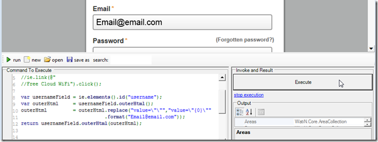](http://lh3.ggpht.com/-8ivpMmAqCnk/UUMpNQ0ueCI/AAAAAAAAKyc/10ALzlUP3hw/s1600-h/image%25255B78%25255D.png)

And since they are using jQuery on this site, we can use also use jQuery to populate that field:

[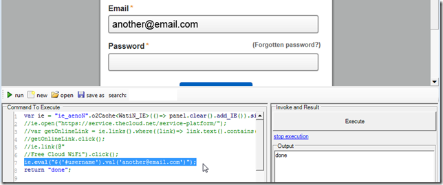](http://lh4.ggpht.com/-tcdwd26ILHs/UUMpQoDKTTI/AAAAAAAAKys/EitonrilTE4/s1600-h/image%25255B81%25255D.png)

**Top tip**: you can also get javascript objects into your C# script. For example here is how to get the value of the email we just populated:

The **document.location** object

The **window.screen** object

A **jQuery** selector:

[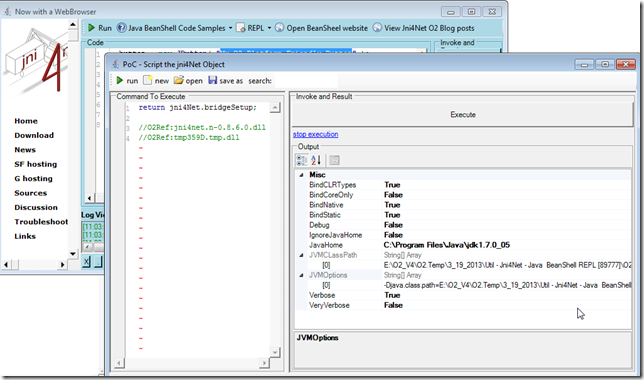](http://lh4.ggpht.com/--lZrtTQCrwY/UUMpfQALqqI/AAAAAAAAKzs/01FB15JmIKk/s1600-h/image%25255B96%25255D.png)

The **body html** (as seen by jQuery)

[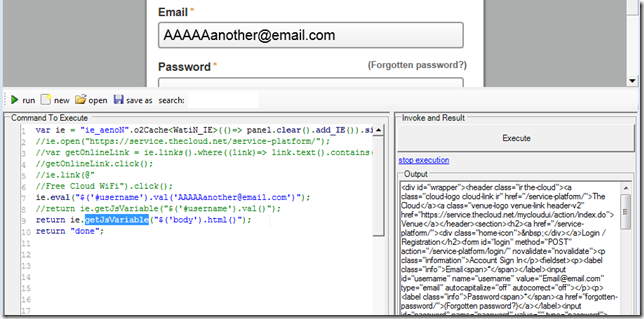](http://lh5.ggpht.com/-iJKPpYPdZY8/UUMpi1yueCI/AAAAAAAAKz8/Z7XruXZuqHM/s1600-h/image%25255B99%25255D.png)

**ok, moving back to our login page....**

Now that we can populate data into both input fields, we need to find the button:

[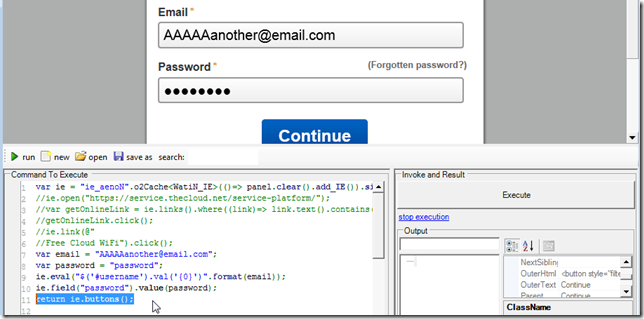](http://lh3.ggpht.com/-0tcOUcsw7ug/UUMpng3FUwI/AAAAAAAAK0M/cMFSJS2rDH0/s1600-h/image%25255B102%25255D.png)

and click on it:

[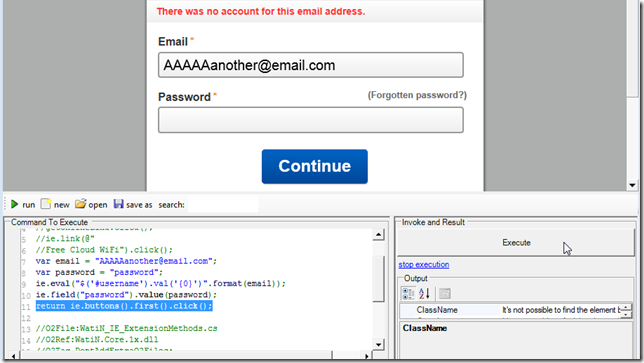](http://lh5.ggpht.com/-aF4i7_mPTVw/UUMptwX67CI/AAAAAAAAK0c/eQnytw0toDk/s1600-h/image%25255B108%25255D.png)

Now that its working let's package the whole script into a lamdba method:

[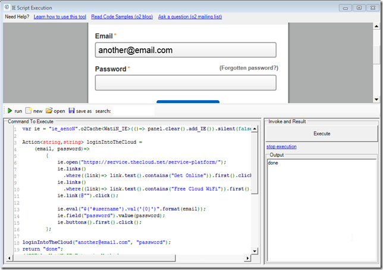](http://lh5.ggpht.com/-XwtTkt-Hw2A/UUMpwsi7GvI/AAAAAAAAK0s/-ZSQRr2YMZ0/s1600-h/image%25255B114%25255D.png)

**Note: **since we have jQuery, we could use it to add an attribute to the link, and then get that link from the C# REPL (instead of doing that lamda search):

Next step is to ask the user for the account details and use it to login:

Now, when you click execute you will get a popup you can use to enter the email and password:

And if all goes good you will be logged in, and google should open up:

Finally, we can make this into a stand alone script:

which will open the IE/WatiN control in a popup window:

[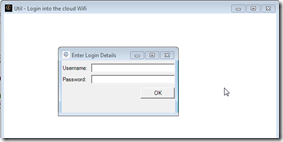](http://lh3.ggpht.com/-zFP2yv7qt3w/UUMqCUAabYI/AAAAAAAAK2M/izNJ75G9430/s1600-h/image%25255B133%25255D.png) and  [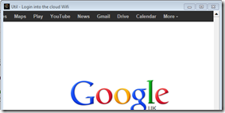](http://lh6.ggpht.com/-oEDojg653bo/UUMqEgtgaQI/AAAAAAAAK2c/iT4uIjzEeBI/s1600-h/image%25255B137%25255D.png)

and even package it as a stand-alone exe:

[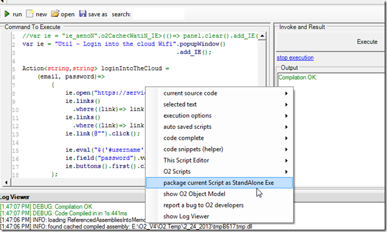](http://lh3.ggpht.com/-Z-S9rojQAgA/UUMqHl-BWzI/AAAAAAAAK2s/pWiifwkT4B8/s1600-h/image%25255B141%25255D.png)

which can then be executed directly:

[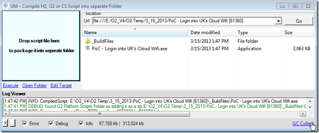](http://lh3.ggpht.com/-wWS7mM-bvYM/UUMqLI03LCI/AAAAAAAAK28/LXU0XDJSf3Y/s1600-h/image%25255B144%25255D.png)

(note that in this case there are no extra folders since the embedded dlls are extracted directly into memory and there are no scripts to dynamically compile)

[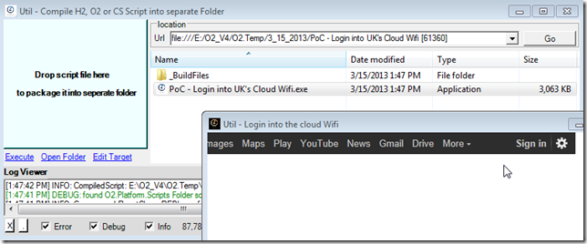](http://lh6.ggpht.com/-ZO0J0jg_WvA/UUMqPtjoQaI/AAAAAAAAK3M/P-vw0G4DW4k/s1600-h/image%25255B147%25255D.png)   
**  
****  
****Scripts used in this blog:**

**Open web page**  

    
    var ie = "ie_aenoN".o2Cache<WatiN_IE>(()=> panel.clear().add_IE()).silent(false);  // ie random value for o2cache makes this object to unique amongst multiple instances of this control  
    ie.open("https://service.thecloud.net/service-platform/");

    return "done";

    //O2File:WatiN_IE_ExtensionMethods.cs   
    //O2Ref:WatiN.Core.1x.dll  
    //O2Tag_DontAddExtraO2Files;  

**Multiple ways to get the GetOnline link:**  

    
    var ie = "ie_aenoN".o2Cache<WatiN_IE>(()=> panel.clear().add_IE()).silent(false);   
    //ie.open("https://service.thecloud.net/service-platform/");  
    var getOnlineLink = ie.link(@"  
    Get Online");  
    return getOnlineLink.text();

    //these also work;  
    return ie.links()[2].text();  
    return ie.links().third().text();  
    return ie.links().where((link)=> link.text().contains("Get Online")).first();

  
    //O2File:WatiN_IE_ExtensionMethods.cs   
    //O2Ref:WatiN.Core.1x.dll  
    //O2Tag_DontAddExtraO2Files;   

**Populating the email field using jQuery:**  

    
    var ie = "ie_aenoN".o2Cache<WatiN_IE>(()=> panel.clear().add_IE()).silent(false);   
    //ie.open("https://service.thecloud.net/service-platform/");  
    //var getOnlineLink = ie.links().where((link)=> link.text().contains("Get Online")).first();  
    //getOnlineLink.click();  
    //ie.link(@"  
    //Free Cloud WiFi").click();  
    ie.eval("$('#username').val('AAAAAanother@email.com')");  
    return ie.getJsVariable("$('#username').val()");  
    return "done";

    //O2File:WatiN_IE_ExtensionMethods.cs   
    //O2Ref:WatiN.Core.1x.dll  
    //O2Tag_DontAddExtraO2Files;   

**Login script as Lambda method**  

    
    var ie = "ie_aenoN".o2Cache<WatiN_IE>(()=> panel.clear().add_IE()).silent(false);

    Action<string,string> loginIntoTheCloud =   
    (email, password)=>  
    {   
    ie.open("https://service.thecloud.net/service-platform/");  
    ie.links()  
    .where((link)=> link.text().contains("Get Online")).first().click();  
    ie.links()  
    .where((link)=> link.text().contains("Free Cloud WiFi")).first().click();  
    ie.link(@"").click();

    ie.eval("$('#username').val('{0}')".format(email));  
    ie.field("password").value(password);  
    ie.buttons().first().click();  
    };

    loginIntoTheCloud("another@email.com", "password");  
    return "done";  
    //O2File:WatiN_IE_ExtensionMethods.cs   
    //O2Ref:WatiN.Core.1x.dll  
    //O2Tag_DontAddExtraO2Files;   

**Adding an ID to an element using jQuery:**  

    
    var ie = "ie_aenoN".o2Cache<WatiN_IE>(()=> panel.clear().add_IE()).silent(false);

    ie.open("https://service.thecloud.net/service-platform/");  
    ie.eval("$(\"a :contains('Online')\").first().parent().attr('id','myLink')");  
    return ie.link("myLink");  
    **Full script with login and redirect to google:**  

        
        var ie = "ie_aenoN".o2Cache<WatiN_IE>(()=> panel.clear().add_IE()).silent(false);

    Action<string,string> loginIntoTheCloud =   
    (email, password)=>  
    {   
    ie.open("https://service.thecloud.net/service-platform/");  
    ie.links()  
    .where((link)=> link.text().contains("Get Online")).first().click();  
    ie.links()  
    .where((link)=> link.text().contains("Free Cloud WiFi")).first().click();  
    ie.link(@"").click();

    ie.eval("$('#username').val('{0}')".format(email));  
    ie.field("password").value(password);  
    ie.buttons().first().click();  
    };

    var credentials = ie.askUserForUsernameAndPassword();

    loginIntoTheCloud(credentials.UserName, credentials.Password);  
    ie.waitForComplete();  
    ie.open("http://www.google.com");

    //O2File:WatiN_IE_ExtensionMethods.cs   
    //O2Ref:WatiN.Core.1x.dll  
    //O2Tag_DontAddExtraO2Files;   
    
**Final version of the script:**  

    
    //var ie = "ie_aenoN".o2Cache<WatiN_IE>(()=> panel.clear().add_IE()).silent(false);   
    var ie = "Util - Login into the cloud Wifi".popupWindow()  
                                               .add_IE();

    Action<string,string> loginIntoTheCloud =   
    (email, password)=>  
    {   
    ie.open("https://service.thecloud.net/service-platform/");  
    ie.links()  
    .where((link)=> link.text().contains("Get Online")).first().click();  
    ie.links()  
    .where((link)=> link.text().contains("Free Cloud WiFi")).first().click();  
    ie.link(@"").click();

    ie.eval("$('#username').val('{0}')".format(email));  
    ie.field("password").value(password);  
    ie.buttons().first().click();  
    };

    var credentials = ie.askUserForUsernameAndPassword();

    loginIntoTheCloud(credentials.UserName, credentials.Password);  
    ie.waitForComplete();  
    ie.open("http://www.google.com");

    //O2File:WatiN_IE_ExtensionMethods.cs   
    //O2Ref:WatiN.Core.1x.dll  
    //O2Tag_DontAddExtraO2Files;  

